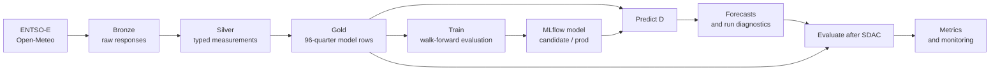

# Model and data

This is the source of truth for what DELU predicts, what the model sees, and when
each value becomes available. `D` means the electricity delivery day.

[Project README](README.md) · [Experiments](EXPERIMENTS.md)

## Core contract

DELU publishes 96 quarter-hour prices and 90% prediction intervals for the next
Germany-Luxembourg Single Day-Ahead Coupling (SDAC) delivery day. It does not
forecast a physical real-time or imbalance price.

The point model learns a correction to the earlier DE-LU EXAA auction:

```text
training target = SDAC(D) - EXAA(D)
point forecast  = EXAA(D) + predicted correction
```

For a forecast run on 9 September:

| Symbol | Date | Meaning |
| :--- | :--- | :--- |
| `D` | 10 September | Delivery day being forecast |
| `D-1` | 9 September | Forecast publication day |
| `D-2` | 8 September | Latest actual load and generation source day |
| `D-7` | 3 September | Longest SDAC price lag |

The target for `D` is unavailable at forecast time and is never a model feature.

## End-to-end lineage



| Stage | Unity Catalog object | Grain | Responsibility |
| :--- | :--- | :--- | :--- |
| Bronze | `delu.bronze.raw` | One raw response per source date and series | Download, validate, retry, and append ENTSO-E XML or weather JSON without transforming it |
| Silver | `delu.silver.measurements` | One timestamped value per series | Keep the latest raw response, parse values and units, and overwrite the typed long-form table |
| Gold | `delu.gold.model_input` | One row per delivery day and wall-clock quarter | Align source dates, normalize every day to 96 quarters, pivot features, and retain a nullable SDAC target |
| Model | `delu.ml.sdac_cqr` | One registered model version | Store MLflow candidates and the promoted `@prod` model |
| Prediction | `delu.gold.forecasts` | One row per delivery day and quarter | Store point and interval forecasts idempotently |
| Prediction run | `delu.gold.forecast_runs` | One row per delivery day | Store model version and input/output drift diagnostics |
| Evaluation | `delu.gold.forecast_metrics` | One row per delivery day | Store settled accuracy, interval, baseline, and monitoring results |

Silver and Gold overwrite their derived tables on each build. Bronze is the durable
recovery boundary: retries and later recovery runs fetch missing source keys, then
rebuild the downstream state.

## Production timing

Job schedules use `Europe/Berlin`; the weather model-run timestamp is UTC as marked.

| Time | Flow | Result |
| :--- | :--- | :--- |
| Daily 02:00 | Recovery | Fetch missing validated source responses, rebuild Silver and Gold, and evaluate eligible stored forecasts |
| `D-1` 00:00 UTC | Weather model run | Supply weather forecasts valid on `D` |
| `D-1` 11:30 | Morning forecast | Fetch features, rebuild Silver and Gold, and publish 96 forecasts for `D` |
| Before `D-1` 15:00 | Production cutoff | Accept only a genuine forecast created before the SDAC result is fetched |
| `D-1` 15:00 | Settlement | Fetch the published SDAC curve for `D`, rebuild Gold, and evaluate the stored forecast |
| Monthly, day 3 at 06:00 | Training | Train through the previous month-end and promote only when all gates pass |

The job graphs and retries are defined in [`resources/`](resources/).

## Gold features for delivery day `D`

`prepare_daily_data` converts Gold to `float32` tensors with shape
`[days, 96, 149]`. Of the 149 estimator features, 143 are stored feature columns and
six are cyclical encodings derived during loading.

| Feature group | Count | Value attached to `D` | Forecast-time provenance |
| :--- | ---: | :--- | :--- |
| EXAA prices | 2 | DE-LU and Austrian EXAA curves for `D` | Fetched during the `D-1` morning run |
| SDAC price lags | 3 | DE-LU SDAC curves for `D-1`, `D-2`, and `D-7` | Previously published outcomes |
| Load and generation forecasts | 5 | Four ENTSO-E forecast curves sourced for `D-1`, plus derived residual load | Shifted forward one day in Gold; these are lagged curves, not forecasts describing `D` |
| Load and generation actuals | 5 | Four actual curves from `D-2`, plus derived residual load | Shifted forward two days in Gold |
| Weather forecasts | 125 | Five fields at 25 locations, valid on `D` | Open-Meteo model run from `D-1` 00:00 UTC |
| Calendar | 9 | Weekend and holiday flags plus quarter, weekday, and month cycles | Deterministic from `D` and holiday calendars |
| **Total** | **149** | One feature vector for each quarter | Available before the production cutoff |

Residual load is `load - solar - onshore wind - offshore wind`. The exact feature
order is defined by [`src/delu/ml/data.py`](src/delu/ml/data.py); source shifts and
joins are defined by [`src/delu/pipeline/gold.py`](src/delu/pipeline/gold.py).

Gold also stores the nullable SDAC target and human-readable calendar columns. The
estimator does not receive the target, timestamps, raw hour/quarter/day/month, or
season columns.

### Weather handling

Bronze requests 48 hours from the `D-1` 00:00 UTC model run. Silver retains only
timestamps whose Berlin local date is `D`; Gold expands the hourly values across
the 96 quarter positions. The five fields are temperature at 2 m, wind speed and
direction at 100 m, shortwave radiation, and cloud cover.

If primary temperature contains a null, `ecmwf_ifs025` supplies only that missing
temperature. Other missing weather values fail validation. Locations and units are
defined in [`src/delu/pipeline/bronze.py`](src/delu/pipeline/bronze.py), and parsing
is implemented in [`src/delu/pipeline/silver.py`](src/delu/pipeline/silver.py).

## Validation and time semantics

- Bronze validates each payload before writing it. ENTSO-E curves must have the
  expected currency, units, 15-minute resolution, finite values, and complete
  delivery-day coverage. Weather must have the expected locations, units, and 48
  consecutive hourly timestamps.
- Silver selects the latest response for each source date and series. It stores
  UTC timestamps, while `delivery_date` remains the Berlin market date.
- Before Gold builds, Great Expectations checks that Silver contains no null or
  NaN measurements and contains every required series.
- Gold drops rows with incomplete features, requires 96 quarters per retained day,
  and permits a wholly missing target for the future prediction day.
- Model loading rejects duplicate quarters, incomplete days, partial targets, and
  non-finite features or targets.

Gold deliberately maps every local day to 96 wall-clock quarters. On daylight
saving transitions, repeated local quarters are averaged and missing quarters are
filled from adjacent values. This gives the estimator a fixed tensor shape, but it
is a modeling normalization rather than the physical 92- or 100-interval day.

## Model lifecycle

### Train

Monthly training reads complete labeled Gold days through the previous month-end.
All splits are chronological:

1. Three expanding 28-day validation folds generate out-of-fold point corrections.
2. Those corrections select shrinkage from 0 to 1 against `SDAC - EXAA` MAE.
3. One final 28-day test window is evaluated once.
4. Within each fit, the preceding data trains lower and upper spread-quantile
   models; the final 28 fitting days conformalize their 90% interval.

The point estimator is a histogram gradient-boosting regressor with absolute-error
loss. The final price is EXAA plus the shrunken correction. A candidate is promoted
only when:

- test MAE beats unchanged EXAA;
- 90% interval coverage is at least 88%; and
- when a compatible production model exists, candidate MAE and interval score both
  beat production.

Every run is logged to MLflow and registered as `@candidate`. A passing candidate
is refit, assigned `@prod`, and exported for the application. A failed candidate is
registered with its blocking reasons but does not replace production.

### Predict

Prediction accepts only tomorrow's delivery date and runs only before 15:00. It
loads one complete target-free Gold day, resolves the MLflow `@prod` version,
validates all 96 point and interval outputs, and merges them into the forecast
tables. The run record also captures feature outlier rate, maximum feature-mean
z-score, and prediction-mean z-score.

### Evaluate

Evaluation considers only complete 96-quarter forecasts created on `D-1` before
15:00. Once Gold contains the complete SDAC curve, it records MAE, RMSE, bias,
interval coverage, mean interval width, interval score, and EXAA and seven-day SDAC
baselines. Rolling error, interval coverage, input drift, and output drift can fail
the job and trigger Databricks notifications.

### Recover

The recovery job accepts an inclusive date range, fetches missing Bronze source
keys, rebuilds Silver and Gold, and evaluates any complete stored forecasts that do
not already have a final metric row. It does not manufacture forecasts for past
days; those would be retrospective predictions, not production forecasts.

## Known data limitations

- The four ENTSO-E forecast features attached to `D` describe `D-1`; they are
  deliberately lagged by Gold and should not be interpreted as true forecasts for
  `D`.
- The fixed 96-quarter daylight-saving normalization loses the distinction between
  repeated physical intervals and synthesizes missing wall-clock intervals.
- `is_weekend` currently misses Sunday because Spark's Sunday value becomes `-1`
  after the current `dayofweek - 2` transformation. The weekday cyclical encoding
  remains cyclically equivalent, but the boolean flag is wrong for Sundays.

## Code map

| Concern | Source |
| :--- | :--- |
| Source selection, retries, and Bronze | [`src/delu/pipeline/bronze.py`](src/delu/pipeline/bronze.py) |
| Parsing and Silver | [`src/delu/pipeline/silver.py`](src/delu/pipeline/silver.py) |
| Feature alignment and Gold | [`src/delu/pipeline/gold.py`](src/delu/pipeline/gold.py) |
| Tensor validation and temporal splits | [`src/delu/ml/data.py`](src/delu/ml/data.py) |
| Estimator and prediction intervals | [`src/delu/ml/model.py`](src/delu/ml/model.py) |
| Training, registry, and promotion | [`src/delu/ml/train.py`](src/delu/ml/train.py) |
| Production prediction | [`src/delu/ml/predict.py`](src/delu/ml/predict.py) |
| Settlement evaluation and monitoring | [`src/delu/ml/evaluate.py`](src/delu/ml/evaluate.py) |
