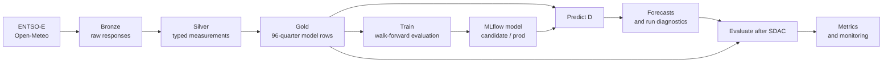

# Model and data

This is the source of truth for what DELU predicts, what the model sees, and when
each value becomes available. `D` means the electricity delivery day.

[Project README](README.md) · [Experiments](EXPERIMENTS.md)

## Core contract

DELU publishes 96 quarter-hour prices and 90% prediction intervals for each
Germany-Luxembourg Single Day-Ahead Coupling (SDAC) delivery day. It does not
forecast a physical real-time or imbalance price.

The operational target is the change between two auctions. EXAA's 10:15 Classic
auction is an early day-ahead price signal, followed by the 12:00 SDAC auction.
EXAA itself describes cross-auction spread trading between these profiles. See
[EXAA trading](https://www.exaa.at/en/energytrading/handel-mit-exaa/).

The point model learns a correction to the earlier DE-LU EXAA auction:

```text
training target = SDAC(D) - EXAA(D)
point forecast  = EXAA(D) + predicted correction
```

For a forecast run on 9 September:

| Symbol | Date | Meaning |
| :--- | :--- | :--- |
| `D` | 10 September | Delivery day being forecast |
| `D-1` | 9 September | Forecast publication day and weather model-run day |
| `D-2` | 8 September | Latest actual load and generation source day |
| `D-7` | 3 September | Longest SDAC price lag |

The target for `D` is never a model feature. ENTSO-E load and renewable forecasts
describe delivery day `D`, but their safe availability differs. Total-load
forecasts are due two hours before the day-ahead gate closure; wind and solar
forecasts are due only by 18:00 Brussels time on `D-1`. See ENTSO-E's
[load definition](https://transparencyplatform.zendesk.com/hc/en-us/articles/16647979768084-Total-Load-Day-Ahead-Actual-6-1-A-6-1-B)
and [generation definition](https://transparencyplatform.zendesk.com/hc/en-us/articles/16648412255380-Generation-Forecast-Day-ahead-14-1-C-).

Silver therefore retains a delivery-day fundamental forecast only when Bronze
actually captured it before 12:00 on `D-1`. Gold stores those nullable curves as
forward research context. Feature data version 2 does not train on them because a
retrospective API query cannot establish the historical pre-cutoff vintage. The
model continues to use pinned weather forecasts and `D-2` measured fundamentals.

## End-to-end lineage



| Stage | Unity Catalog object | Grain | Responsibility |
| :--- | :--- | :--- | :--- |
| Bronze | `delu.bronze.raw` | One raw response per source date and series | Download, validate, retry, and append ENTSO-E XML or weather JSON without transforming it |
| Silver | `delu.silver.measurements` | One timestamped value per series | Keep the latest raw response, parse values and units, and overwrite the typed long-form table |
| Gold | `delu.gold.model_input` | One row per delivery day and wall-clock quarter | Align source dates, normalize every day to 96 quarters, pivot features, and retain a nullable SDAC target |
| Model | `delu.ml.sdac_cqr` | One registered model version | Store MLflow candidates and the promoted `@prod` model |
| Prediction | `delu.gold.forecasts` | One row per delivery day and quarter | Store point and interval forecasts idempotently |
| Prediction run | `delu.gold.forecast_runs` | One row per delivery day | Store model version, publication status, and input/output drift diagnostics |
| Evaluation | `delu.gold.forecast_metrics` | One row per delivery day | Store settled accuracy for audit and on-time rolling monitoring results |

Silver and Gold rebuild their derived tables from validated Bronze responses.
Missing inputs stay pending; a run with no complete data preserves the existing
output. Bronze is durable: subsequent runs fetch only missing source keys and
rebuild the downstream state.

## Processing and retries

The single `data_pipeline` job runs at 02:30, 10:30, 11:30, and 13:30 in
Europe/Berlin, with one active run and native Databricks queueing enabled. The two
pre-SDAC attempts cover the live auction window, 13:30 covers settlement work, and
02:30 catches delayed sources. This reduces scheduled starts from 48 to four per
day, a 92% reduction, without changing retry or backfill logic. Both jobs use the
Databricks `STANDARD` performance target to favor lower-cost serverless execution.

The single-run limit serializes writes to the same Bronze, Silver, Gold, forecast,
and metric tables. Raising it would let separate runs rebuild the same derived
tables concurrently. Databricks queues runs for up to 48 hours; source gaps remain
pending beyond that and are checked by later runs. The Free Edition's five-task
account limit counts executing tasks, not the number of steps defined in a job.
This pipeline's five dependent tasks execute sequentially. See the official
[queueing documentation](https://docs.databricks.com/aws/en/jobs/configure-job#enable-queueing-of-job-runs)
and [Free Edition limits](https://docs.databricks.com/aws/en/getting-started/free-edition-limitations).

- Valid source responses are retained even when another API is unavailable.
- Missing, incomplete, rate-limited, and temporarily unavailable source responses
  are retried on subsequent runs, with two concurrent requests per source.
- Gold publishes complete feature days; missing days do not block ready days.
- Predictions can be published or backfilled at any time. Existing published
  values and timestamps are preserved.
- Evaluation waits for actual prices and keeps every stored forecast auditable.
  Only on-time forecasts contribute to rolling production monitoring.
- Authentication, configuration, and unexpected programming errors remain visible
  failures. Downstream tasks can still process previously available data.

Monthly training runs on day 3 at 06:00 Europe/Berlin, using the previous month-end
as the chronological training boundary. Weather uses the `D-1` 00:00 UTC run.
The job graphs are defined in [`resources/`](resources/).
Development deploys the same two job definitions with paused schedules. Both
targets currently share the `delu` catalog, so dev jobs are not an isolated data
environment and must not run alongside production writers.

## Gold features for delivery day `D`

`prepare_daily_data` converts Gold to `float32` tensors with shape
`[days, 96, 144]`. Of the 144 estimator features, 138 are stored feature columns and
six are cyclical encodings derived during loading.

| Feature group | Count | Value attached to `D` | Forecast-time provenance |
| :--- | ---: | :--- | :--- |
| EXAA prices | 2 | DE-LU and Austrian EXAA curves for `D` | Fetched when the source publishes the curve |
| SDAC price lags | 3 | DE-LU SDAC curves for `D-1`, `D-2`, and `D-7` | Previously published outcomes |
| Load and generation actuals | 5 | Four actual curves from `D-2`, plus derived residual load | Shifted forward two days in Gold |
| Weather forecasts | 125 | Five fields at 25 locations, valid on `D` | Open-Meteo model run from `D-1` 00:00 UTC |
| Calendar | 9 | Weekend and holiday flags plus quarter, weekday, and month cycles | Deterministic from `D` and holiday calendars |
| **Total** | **144** | One feature vector for each quarter | Complete before the model runs |

Residual load is `load - solar - onshore wind - offshore wind`. The exact feature
order is defined by [`src/delu/ml/data.py`](src/delu/ml/data.py); source shifts and
joins are defined by [`src/delu/pipeline/gold.py`](src/delu/pipeline/gold.py).

Gold also stores the nullable SDAC target, point-in-time delivery-day fundamental
forecasts when available, human-readable calendar columns, and
`feature_data_version`. The captured forecasts are research columns, not version 2
estimator features. The estimator also does not receive the target, timestamps,
contract version, raw hour/quarter/day/month, or season columns. Both training and
prediction reject a stale Gold feature contract, and a model trained under an old
contract leaves prediction pending rather than being applied to changed semantics.

### Weather handling

Bronze requests 48 hours from the `D-1` 00:00 UTC model run. Silver retains only
timestamps whose Berlin local date is `D`; Gold expands the hourly values across
the 96 quarter positions. The five fields are temperature at 2 m, wind speed and
direction at 100 m, shortwave radiation, and cloud cover.

The API determines availability. There is no 09:00 Europe/Berlin gate: an available
run is processed, and an unavailable run remains pending for the next attempt.

If primary temperature contains a null, `ecmwf_ifs025` supplies only that missing
temperature. Other missing weather values leave the response pending for retry. Locations and units are
defined in [`src/delu/pipeline/bronze.py`](src/delu/pipeline/bronze.py), and parsing
is implemented in [`src/delu/pipeline/silver.py`](src/delu/pipeline/silver.py).

See [Data sources and attribution](DATA_SOURCES.md) for provider links, licence
references, and the distinction between per-location model inputs and the
25-location means displayed on the website.

## Validation and time semantics

- Bronze validates each payload before writing it. ENTSO-E curves must have the
  expected currency, units, 15-minute resolution, finite values, and complete
  delivery-day coverage. Weather must have the expected locations, units, and 48
  consecutive hourly timestamps.
- Silver selects the latest response for each source date and series. It stores
  UTC timestamps, while `delivery_date` remains the Berlin market date. Forecast
  fundamentals captured at or after 12:00 on `D-1`, or during a backfill, remain
  in Bronze but are excluded from Silver and model evidence.
- Before Gold builds, Spark checks that Silver contains no null or
  NaN measurements. Absent sources leave their dependent days pending.
- Gold drops rows with incomplete features, requires 96 quarters per retained day,
  permits missing targets during prediction, and stamps the feature data contract.
- Model loading rejects duplicate quarters, incomplete days, and non-finite
  features or targets. It also rejects snapshots built with another feature data
  version. Training requires complete targets; prediction does not.

Gold deliberately maps every local day to 96 wall-clock quarters. On daylight
saving transitions, repeated local quarters are averaged and missing quarters are
filled from adjacent values. This gives the estimator a fixed tensor shape, but it
is a modeling normalization rather than the physical 92- or 100-interval day.

## Model lifecycle

### Train

Monthly training reads complete labeled Gold days through the previous month-end.
All splits are chronological:

1. Six expanding 28-day validation folds generate out-of-fold point corrections.
2. Those corrections select shrinkage from 0 to 1 against `SDAC - EXAA` MAE.
3. One final 28-day test window is evaluated once.
4. Within each fit, the preceding data trains lower and upper spread-quantile
   models; the final 28 fitting days conformalize their 90% interval.

The point estimator is a histogram gradient-boosting regressor with absolute-error
loss. The final price is EXAA plus the shrunken correction. Every fold and the test
window also evaluate unchanged EXAA and a quarter-specific empirical spread
forecast with conformalized intervals. A candidate is promoted only when:

- test MAE beats both unchanged EXAA and the empirical spread point forecast;
- test interval score beats the empirical spread interval;
- point MAE beats both baselines in at least four of six rolling folds;
- the lower ends of paired, whole-day bootstrap 95% intervals for MAE gain over
  both EXAA and the empirical spread forecast are above zero;
- 90% interval coverage is at least 88%; and
- when a compatible production model exists, candidate MAE and interval score both
  beat production.

Every run is logged to MLflow and registered as `@candidate`. A passing candidate
is refit, assigned `@prod`, and exported for the application. A failed candidate is
registered with its blocking reasons but does not replace production.

Feature data version 2 is a deliberate cutover. First rebuild Silver and Gold with
the point-in-time fundamental rule, then run training against that table. Until a
version 2 candidate passes every gate and becomes `@prod`, new forecast days stay
pending. The pipeline continues to retry inputs and evaluate existing forecasts;
it never applies the old model to the changed features. A failed candidate should
be investigated, not force-promoted merely to preserve output volume.

### Predict

Prediction loads a complete Gold day, resolves the MLflow `@prod` version,
validates all 96 point and interval outputs, and stores them with their actual
publication timestamp. The run record also captures feature outlier rate,
maximum feature-mean z-score, and prediction-mean z-score. Repeated runs skip
already published days. A run is classified as `on_time` only when it was created
on `D-1` at or after 10:15 and before 12:00 Europe/Berlin. Later `D-1` runs are
`late`; every other run is `backfill`.

### Evaluate

Evaluation considers every complete 96-quarter stored forecast once Gold contains
the complete SDAC curve. It records MAE, RMSE, bias, interval coverage, mean
interval width, interval score, and EXAA and seven-day SDAC baselines. Publication
status never removes the daily audit result. Rolling accuracy, interval coverage,
and input/output drift claims use on-time forecasts only. A late or backfilled day
with no prior on-time history has null rolling metrics. When an older on-time gap
is filled, subsequent rolling metrics are recomputed in date order.

### Backfill

The same pipeline accepts an inclusive delivery date range. It fetches missing
source data, including lag dependencies, rebuilds Silver and Gold, fills missing
predictions, and evaluates them. Without a range it searches all source history,
fills prediction gaps from the first stored forecast (or the model's registration
date on first use), and checks all stored forecasts for missing evaluations.
Backfilled predictions use the current production model and their real creation
timestamps. They are not a replacement for chronological held-out model testing.
There is no separate recovery job or age limit on missing data.

## Public read caching

Successful SQL query results are cached in the FastAPI process: five minutes for
forecast and health reads, 15 minutes for the date index, and 12 hours for settled
features, weather, and observations. A successful cached response can be served
for up to seven days when the SQL warehouse is temporarily unavailable. Errors are
never cached. HTTP responses also publish browser and shared-cache lifetimes, and
the website polls dates every 15 minutes, unsettled forecasts every five minutes,
and settled forecasts every 30 minutes. Model artifacts remain volume-backed.

## Current revision limitation

Bronze currently stores the first validated response for each `(source date,
series)` key and does not refetch that key. `ingested_at` records retrieval order,
not an authoritative provider revision. This keeps the retry contract simple but
means later source corrections are not represented. A future revision-aware design
must store provider revision metadata or payload hashes and bind every forecast to
the exact Gold version or input hashes it used before Silver or Gold can switch to
corrected values.

Development and production still share the `delu` catalog. Job-level concurrency
protects one job from itself, not from a different job or a manual writer, so a dev
writer must remain paused until separate catalogs or schemas are configured.

## Code map

| Concern | Source |
| :--- | :--- |
| Source selection, retries, and Bronze | [`src/delu/pipeline/bronze.py`](src/delu/pipeline/bronze.py) |
| Parsing and Silver | [`src/delu/pipeline/silver.py`](src/delu/pipeline/silver.py) |
| Feature alignment and Gold | [`src/delu/pipeline/gold.py`](src/delu/pipeline/gold.py) |
| Tensor validation and temporal splits | [`src/delu/ml/data.py`](src/delu/ml/data.py) |
| Estimator and prediction intervals | [`src/delu/ml/model.py`](src/delu/ml/model.py) |
| Training, registry, and promotion | [`src/delu/ml/train.py`](src/delu/ml/train.py) |
| Production prediction | [`src/delu/ml/predict.py`](src/delu/ml/predict.py) |
| Settlement evaluation and monitoring | [`src/delu/ml/evaluate.py`](src/delu/ml/evaluate.py) |
