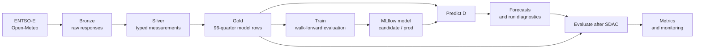

# Model and data

This is the source of truth for what DELU predicts, what the model sees, and when
each value becomes available. `D` means the electricity delivery day.

[Project README](README.md) · [Experiments](EXPERIMENTS.md)

## Core contract

DELU publishes 96 quarter-hour prices and 90% prediction intervals for each
Germany-Luxembourg Single Day-Ahead Coupling (SDAC) delivery day. It does not
forecast a physical real-time or imbalance price.

The current model-data contract is version 2. It includes interval-aligned
shortwave radiation and explicit `D-1` forecast feature names. Prediction rejects
models trained on another data version, so the corrected history and model are
released together.

The point model learns a correction to the earlier DE-LU EXAA auction:

```text
training target = SDAC(D) - EXAA(D)
point forecast  = EXAA(D) + predicted correction
```

For a forecast run on 9 September:

| Symbol | Date | Meaning |
| :--- | :--- | :--- |
| `D` | 10 September | Delivery day being forecast |
| `D-1` | 9 September | Source day for lagged forecast inputs |
| `D-2` | 8 September | Latest actual load and generation source day |
| `D-7` | 3 September | Longest SDAC price lag |

The target for `D` is never a model feature. Publication can happen later if
upstream data is delayed; its actual timestamp is always retained.

## End-to-end lineage



| Stage | Unity Catalog object | Grain | Responsibility |
| :--- | :--- | :--- | :--- |
| Bronze | `delu.bronze.raw` | One raw response version per source date and series | Download, validate, retry, and append ENTSO-E XML or weather JSON without transforming it |
| Silver | `delu.silver.measurements` | One physical timestamped value per series | Keep the latest raw response, parse values and units, and overwrite the typed long-form table |
| Calendar | `delu.silver.holidays` | One date with DE and LU holiday flags | Cache validated calendar dates, including non-holidays, for reuse by Gold |
| Gold | `delu.gold.model_input` | One row per delivery day and wall-clock quarter | Align source dates, normalize every day to 96 quarters, pivot features, and retain a nullable SDAC target |
| Model | `delu.ml.sdac_cqr` | One registered model version | Store MLflow candidates and the promoted `@prod` model |
| Prediction | `delu.gold.forecasts` | One row per delivery day and quarter | Store point and interval forecasts idempotently |
| Prediction run | `delu.gold.forecast_runs` | One row per delivery day | Store model and Gold versions plus input/output drift diagnostics |
| Evaluation | `delu.gold.forecast_metrics` | One row per delivery day | Store physical and normalized accuracy, interval, baseline, and monitoring results |

Silver and Gold rebuild their derived tables from validated Bronze responses.
Missing inputs stay pending; a run with no complete data preserves the existing
output. Bronze is durable: subsequent runs fetch only missing source keys and
rebuild the downstream state. A bounded `--refresh true --start ... --end ...`
run re-fetches accepted keys and appends only changed source payloads. Evaluation
then recomputes from the repaired start date through the latest eligible settlement
so later rolling metrics remain consistent.

## Processing and retries

The single `data_pipeline` job runs at 02:30, 10:30, 11:30, 13:30, and 15:30 in
Europe/Berlin, with one active run and native Databricks queueing enabled. These
five starts cover overnight delays, forecast publication, pre-settlement retries,
and settlement work. This is a 90% reduction from 48 starts per day. Both scheduled
jobs use the Databricks `STANDARD` performance target for cost-efficient serverless
execution. The task graph, task retries, and backfill behavior are unchanged.

The single-run limit serializes writes to the same Bronze, Silver, Gold, forecast,
and metric tables. Raising it would let separate runs rebuild the same derived
tables concurrently. Databricks queues runs for up to 48 hours; source gaps remain
pending beyond that and are checked by later runs. The Free Edition's five-task
account limit counts executing tasks, not the number of steps defined in a job.
This pipeline's five dependent tasks execute sequentially. See the official
[queueing documentation](https://docs.databricks.com/aws/en/jobs/configure-job#enable-queueing-of-job-runs)
and [Free Edition limits](https://docs.databricks.com/aws/en/getting-started/free-edition-limitations).

- Valid source responses are retained even when another API is unavailable.
- Missing, incomplete, rate-limited, and temporarily unavailable source responses
  are retried on subsequent runs, with two concurrent requests.
  Malformed responses fail the task. Newest source dates are attempted first.
- Gold publishes complete feature days; missing days do not block ready days.
- Predictions can be published or backfilled at any time. Existing published
  values and timestamps are preserved. Each result is classified as operational
  or retrospective at the `D-1` 12:00 Europe/Berlin decision cutoff.
- Evaluation waits for actual prices. Only operational forecasts enter rolling
  monitoring; retrospective reconstructions retain accuracy metrics separately.
- Authentication, configuration, and unexpected programming errors remain visible
  failures. Downstream tasks can still process previously available data.

Monthly training runs on day 3 at 06:00 Europe/Berlin, using the previous month-end
as the chronological training boundary. Weather uses the `D-1` 00:00 UTC run.
The job graphs are defined in [`resources/`](resources/).
Development deploys the same two job definitions with paused schedules. Both
targets currently share the `delu` catalog, so dev jobs are not an isolated data
environment and must not run alongside production writers.

## Gold features for delivery day `D`

`prepare_daily_data` converts Gold to `float32` tensors with shape
`[days, 96, 149]`. Of the 149 estimator features, 143 are stored feature columns and
six are cyclical encodings derived during loading.

| Feature group | Count | Value attached to `D` | Forecast-time provenance |
| :--- | ---: | :--- | :--- |
| EXAA prices | 2 | DE-LU and Austrian EXAA curves for `D` | Fetched when the source publishes the curve |
| SDAC price lags | 3 | DE-LU SDAC curves for `D-1`, `D-2`, and `D-7` | Previously published outcomes |
| Load and generation forecasts | 5 | Four ENTSO-E forecast curves sourced for `D-1`, plus derived residual load | Shifted forward one day in Gold; `*_forecast_delivery_d_minus_1_mw` names make clear that these curves describe `D-1`, not `D` |
| Load and generation actuals | 5 | Four actual curves from `D-2`, plus derived residual load | Shifted forward two days in Gold |
| Weather forecasts | 125 | Five fields at 25 locations, valid on `D` | Open-Meteo model run from `D-1` 00:00 UTC |
| Calendar | 9 | Weekend and holiday flags plus quarter, weekday, and month cycles | Deterministic from `D` and holiday calendars |
| **Total** | **149** | One feature vector for each quarter | Complete before the model runs |

Residual load is `load - solar - onshore wind - offshore wind`. The exact feature
order is defined by [`src/delu/ml/data.py`](src/delu/ml/data.py); source shifts and
joins are defined by [`src/delu/pipeline/gold.py`](src/delu/pipeline/gold.py).

Gold also stores the nullable SDAC target and human-readable calendar columns. The
estimator does not receive the target, timestamps, raw hour/quarter/day/month, or
season columns.

### Weather handling

Bronze requests 48 hours from the `D-1` 00:00 UTC model run. Silver retains only
hours represented on Berlin delivery day `D`; Gold expands the hourly values
across the 96 quarter positions. Open-Meteo shortwave radiation is a
preceding-hour mean, so Silver moves its timestamp back one hour before selecting
the delivery day. The five fields are temperature at 2 m, wind speed and
direction at 100 m, shortwave radiation, and cloud cover.

The API determines availability. There is no 09:00 Europe/Berlin gate: an available
run is processed, and an unavailable run remains pending for the next attempt.

If primary temperature contains a null, `ecmwf_ifs025` supplies only that missing
temperature. Other missing weather values leave the response pending for retry. Locations and units are
defined in [`src/delu/pipeline/bronze.py`](src/delu/pipeline/bronze.py), and parsing
is implemented in [`src/delu/pipeline/silver.py`](src/delu/pipeline/silver.py).

See [Data sources and attribution](DATA_SOURCES.md) for provider links, licence
references, and the distinction between per-location model inputs and the
25-location means displayed on the website.

## Validation and time semantics

- Bronze validates each payload before writing it. ENTSO-E curves must have the
  expected currency, units, 15-minute resolution, finite values, and complete
  delivery-day coverage. A03 values are forward-filled only within their
  published `Period`; they are never extended into unpublished hours. Weather
  must have the expected locations, units, and 48 consecutive hourly timestamps.
- Silver selects the latest response for each source date and series. It stores
  UTC timestamps, while `delivery_date` remains the Berlin market date.
- Before Gold builds, Spark checks that Silver contains no non-finite values,
  duplicate keys, missing timestamps, or misaligned timestamps. Every available
  electricity series must match the exact 92, 96, or 100-quarter UTC grid, and
  every weather series the exact 23, 24, or 25-hour grid. Absent whole sources
  leave their dependent days pending. The only source exception is the verified
  96-quarter suffix published for solar and onshore-wind forecasts on the autumn
  overlap: Silver preserves those 96 observations and Gold fills only their four
  absent leading model slots from the first published value.
- Gold drops rows with incomplete features, requires 96 quarters per retained day,
  and permits missing targets during prediction.
- Model loading rejects duplicate quarters, incomplete days, and non-finite
  features or targets. Training requires complete targets; prediction does not.

Gold deliberately maps every local day to 96 wall-clock quarters. On daylight
saving transitions, repeated scalar quarters are averaged, repeated wind
directions use a circular mean, and the known spring clock gap is filled from
adjacent values. An undefined circular mean is rejected. This gives the estimator
a fixed tensor shape, but it is a modeling normalization rather than the physical
92- or 100-interval day.

## Model lifecycle

### Train

Monthly training reads complete labeled Gold days through the previous month-end.
All splits are chronological:

1. Three expanding 28-day validation folds generate out-of-fold point corrections.
2. Those corrections select shrinkage from 0 to 1 against `SDAC - EXAA` MAE.
3. One final 28-day test window is evaluated once.
4. Within each fit, the preceding data trains lower and upper spread-quantile
   models; the final 28 fitting days conformalize their 90% interval.

The point estimator is a histogram gradient-boosting regressor with absolute-error
loss. The final price is EXAA plus the shrunken correction. A candidate is promoted
only when:

- test MAE beats unchanged EXAA;
- 90% interval coverage is at least 88%; and
- when a compatible production model exists, candidate MAE and interval score both
  beat production.

Every run is logged to MLflow and registered as `@candidate`. A passing candidate
is refit, assigned `@prod`, and exported for the application. A failed candidate is
registered with its blocking reasons but does not replace production.

### Predict

Prediction loads a complete Gold day, resolves the MLflow `@prod` version,
validates all 96 point and interval outputs, and stores them with their actual
creation timestamp and `forecast_kind`. A result created no later than `D-1`
12:00 Europe/Berlin is operational; a later or backfilled result is retrospective.
The run record also captures the Gold Delta version, feature outlier rate, maximum
feature-mean z-score, and prediction-mean z-score. Repeated runs skip already
published days. Scheduled runs after the cutoff fail if tomorrow lacks an
operational forecast, which uses the existing job failure notification.

### Evaluate

Evaluation considers every complete 96-slot forecast once Gold contains the
complete SDAC curve. Its primary MAE, RMSE, bias, interval coverage, mean interval
width, interval score, and baselines compare the forecast with Silver's 92, 96, or
100 physical delivery timestamps. It also records the same metrics with a
`normalized_96_` prefix as model diagnostics. Repeated autumn quarters therefore
contribute two physical errors, while nonexistent spring quarters contribute none.
Only operational results enter rolling metrics and drift monitoring.

### Backfill

The same pipeline accepts an inclusive delivery date range. It fetches missing
source data, including lag dependencies, rebuilds Silver and Gold, fills missing
predictions, and evaluates them. Without a range it searches all source history,
fills prediction gaps from the first stored forecast (or the model's registration
date on first use), and checks all stored forecasts for missing evaluations.
Backfilled predictions use the current production model and their real creation
timestamps. They are classified as retrospective and never enter operational
rolling metrics. They are not a replacement for chronological held-out model
testing. There is no separate recovery job or age limit on missing data.

## Public read caching

Successful SQL results are cached in the FastAPI process for five minutes for
health and forecasts, 15 minutes for the date index, and 12 hours for features,
weather, and observations. An expired success can be served for up to seven days
when Databricks is unavailable, and another refresh is delayed for five minutes
after a failure. Failed reads are not cached when no prior success exists.

API responses also advertise browser and shared-cache lifetimes. The website polls
the date index every 15 minutes, pending forecasts every five minutes, and settled
forecasts every 30 minutes. The server cache is intentionally process-local and is
empty after a process restart; browser cache entries can still be reused according
to their response headers.

## Code map

| Concern | Source |
| :--- | :--- |
| Source selection, retries, and Bronze | [`src/delu/pipeline/bronze.py`](src/delu/pipeline/bronze.py) |
| Parsing and Silver | [`src/delu/pipeline/silver.py`](src/delu/pipeline/silver.py) |
| Feature alignment and Gold | [`src/delu/pipeline/gold.py`](src/delu/pipeline/gold.py) |
| Tensor validation and temporal splits | [`src/delu/ml/data.py`](src/delu/ml/data.py) |
| Estimator and prediction intervals | [`src/delu/ml/model.py`](src/delu/ml/model.py) |
| Training, registry, and promotion | [`src/delu/ml/train.py`](src/delu/ml/train.py) |
| Production prediction | [`src/delu/ml/predict.py`](src/delu/ml/predict.py) |
| Settlement evaluation and monitoring | [`src/delu/ml/evaluate.py`](src/delu/ml/evaluate.py) |
