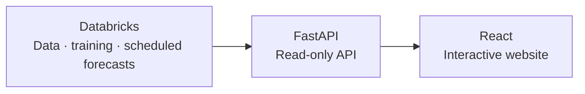

<h1 align="center">DELU</h1>

<p align="center">
  Electricity price forecasts for Germany and Luxembourg.<br>
  Explore each day’s prices, prediction intervals, and market data.
</p>

<p align="center">
  <a href="#the-project">Overview</a> ·
  <a href="https://delu.bhanuprasanna.com/">Live site</a> ·
  <a href="#run-locally">Run locally</a> ·
  <a href="#deploy-on-render">Deploy</a> ·
  <a href="CONTRIBUTING.md">Contribute</a>
</p>

<p align="center">
  <a href="https://github.com/bhanuprasanna2001/delu/actions/workflows/ci.yml">
    
  </a>
  <a href="https://delu.bhanuprasanna.com/">
    
  </a>
</p>

## The project

DELU forecasts electricity prices at 15-minute intervals for the Germany–Luxembourg
market. It pairs model predictions with uncertainty intervals, then compares them
with published Single Day-Ahead Coupling (SDAC) prices when results are available.

- **Explore a day.** Navigate dates and hover over the chart to inspect each price.
- **Look closer.** Open the detailed view for forecast inputs, settlement metrics,
  and load and generation charts.
- **Follow the results.** See actual prices and model performance as they arrive.
- **Take the data with you.** Download the production model and Gold dataset, the
  cleaned data used by the forecasting pipeline.

## How it works



Databricks prepares the data, trains the model, and stores forecasts. FastAPI reads
those results; React displays them in the browser. On Render, the website and API
run together in one service, with credentials kept on the server.

| Scheduled job | Time in Europe/Berlin | What it does |
| :--- | :--- | :--- |
| Forecast | Daily, 11:30 | Builds inputs and publishes 96 forecasts with prediction intervals. |
| Settlement | Daily, 15:00 | Fetches published prices and evaluates forecast accuracy and coverage. |
| Retraining | Monthly, day 3 at 06:00 | Evaluates a candidate model and promotes it if the quality checks pass. |

The model starts with the early EXAA auction price and learns a correction using
boosted trees. Calibrated prediction intervals target 90% coverage. Results appear
after the scheduled jobs complete and the required data is available.

**Reading the charts:** historical dates may contain observations without a stored
model forecast. Load and generation inputs compare forecasts from the previous day
with actual values from two days earlier; they represent different delivery days.

## Run locally

You need **Python 3.12+**, **Node.js 24+**, and **[uv](https://docs.astral.sh/uv/)**.
Live data also requires access to the existing Databricks tables and model exports.
See [Databricks access](CONTRIBUTING.md#databricks-access) for the required permissions.

### 1. Get the project

```bash
git clone https://github.com/bhanuprasanna2001/delu.git
cd delu
uv sync --locked --all-groups
npm --prefix frontend ci
```

### 2. Add your connection details

```bash
cp .env.render.example .env.render
```

Open `.env.render` and fill in `DATABRICKS_CLIENT_ID` and
`DATABRICKS_CLIENT_SECRET`. The DELU workspace, warehouse, and resource names are
already filled in. Use your own values if connecting to another configured
workspace. This file is ignored by Git.

### 3. Start the API

```bash
uv run --env-file .env.render uvicorn app.delu_app.api:app --reload --host 127.0.0.1 --port 8000
```

API documentation is available at <http://127.0.0.1:8000/docs>.

### 4. Start the website

In a second terminal, from the repository root:

```bash
npm --prefix frontend run dev
```

Open **<http://127.0.0.1:5173>**. Vite forwards API requests to port 8000.
The first data request can take longer while the Databricks SQL warehouse starts;
the website displays a loading message while you wait.

## Deploy on Render

[](https://render.com/deploy?repo=https://github.com/bhanuprasanna2001/delu)

1. Click **Deploy to Render** and connect the GitHub repository.
2. Enter `DATABRICKS_CLIENT_ID` and `DATABRICKS_CLIENT_SECRET`. The remaining values
   are provided by [render.yaml](render.yaml).
3. Review the selected **paid plan**, then click **Deploy**. Open the public
   `onrender.com` URL once the service is live.

Visitors do not need a Databricks account. Data, training, and scheduled jobs stay
in Databricks. Later commits deploy after GitHub checks pass.

The configured service uses Frankfurt and a paid plan to avoid idle sleep. For
connection permissions, deployment checks, and the authenticated Databricks Apps
option, see the [contributing guide](CONTRIBUTING.md#deployment-reference).

## Contributing

Start with [CONTRIBUTING.md](CONTRIBUTING.md) for the project map, checks to run,
and the pull request workflow. Browser tests use fixtures and can run without
Databricks credentials.

Built with React, Vite, TypeScript, Tailwind CSS, FastAPI, and Databricks.
Market data comes from [ENTSO-E](https://transparency.entsoe.eu/), with holiday
data from [OpenHolidays](https://www.openholidaysapi.org/).
