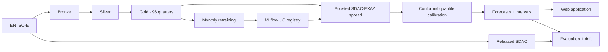

<p align="center">
  <i><strong>DELU</strong></i>
</p>

---

DE-LU quarter-hourly SDAC forecasting with a cutoff-safe Gold table,
EXAA-anchored residual learning, calibrated prediction intervals, MLflow, and
Databricks batch jobs.



Sources:

- [ENTSO-E](https://transparency.entsoe.eu/) for prices, load, wind, and solar
- [OpenHolidays](https://www.openholidaysapi.org/) for public holidays

## Jobs

All schedules use `Europe/Berlin`:

- `delu-morning-forecast` at 11:30: Bronze morning, Silver, Gold, then D batch
  inference.
- `delu-settlement` at 15:00: fetch released D SDAC, rebuild Silver and Gold,
  then evaluate point accuracy and interval coverage.
- `delu-monthly-training` at 06:00 on day 3: train only through the previous
  month-end, select correction shrinkage on rolling-origin folds, calibrate on
  the latest 28 labeled days, test, register a candidate, and promote it to
  `@prod` only when its gates pass.

The point forecast starts from the already available delivery-day DE-LU EXAA
price and learns only the smaller SDAC-minus-EXAA correction. Separate 5th and
95th percentile models capture asymmetric, feature-dependent uncertainty. A
finite-sample conformal correction targets 90% marginal coverage.

The jobs write `delu.gold.forecasts`, `delu.gold.forecast_runs`, and
`delu.gold.forecast_metrics`. Models live at `delu.ml.sdac_cqr` with
`@candidate` and `@prod` aliases.

## Monitoring and feedback

This system does not need human labeling or an active-learning loop. Its useful
feedback is the market outcome:

1. The 11:30 job stores an immutable forecast and its model version.
2. The 15:00 job stores released SDAC prices as natural labels, joins them to
   that forecast, and calculates MAE, RMSE, bias, PICP, MPIW, and interval score.
3. Rolling point-error and interval-coverage drift are evaluated against the
   production model and EXAA baseline. A breached threshold fails the task and
   uses native Databricks job email notifications.
4. Settled Gold rows become training history. On day 3, a candidate is promoted
   only if it beats EXAA and the existing production model while retaining
   acceptable interval coverage.

The website therefore displays this operational feedback rather than asking a
user whether a price forecast was correct. Product feedback can be added later
for UI problems, but it is not a model label.

## Website

The React + Vite + TypeScript website is in `frontend/`, styled with Tailwind
and checked with Oxlint. The centered overview opens into a detailed view with
quarter-hour tooltips, prediction intervals, date navigation, settlement
metrics, input tables, model and Gold downloads, and load/generation plots.

Use Node.js 24 or newer:

```bash
npm --prefix frontend ci
npm --prefix frontend run dev
```

Open <http://127.0.0.1:5173>. In another terminal, start the API with your
authenticated Databricks profile and the resource names from the existing app:

```bash
databricks apps get delu-api-prod --profile "bhanu prasanna"

export DATABRICKS_CONFIG_PROFILE="bhanu prasanna"
export DATABRICKS_WAREHOUSE_ID="<warehouse resource ID from the app>"
export DELU_GOLD_TABLE="delu.gold.model_input"
export DELU_FORECAST_TABLE="delu.gold.forecasts"
export DELU_FORECAST_RUN_TABLE="delu.gold.forecast_runs"
export DELU_METRICS_TABLE="delu.gold.forecast_metrics"
export DELU_MODEL_VOLUME="/Volumes/delu/gold/model_exports"
uv run uvicorn app.delu_app.api:app --host 127.0.0.1 --port 8000
```

Vite proxies `/api` to the local backend. No credentials go into the frontend.
The production build is served by FastAPI from `app/static` under the same
Databricks authentication as the API:

```bash
npm --prefix frontend run lint
npm --prefix frontend run build
npm --prefix frontend exec -- playwright install chromium
npm --prefix frontend test
```

Build before starting the production API or deploying the bundle. Generated
assets are ignored by Git and explicitly included in bundle synchronization.
The backend respects `DATABRICKS_APP_PORT`, with 8000 as its local fallback.

### Deploy the website

The website and API share the existing **delu-api-prod** Databricks App:
<https://delu-api-prod-7474652950254462.aws.databricksapps.com>.
Databricks serves the built HTML, CSS, and JavaScript; React runs in the user's
browser and requests `/api` on the same host. The API reads Databricks tables
and model exports. A separate frontend host is not needed.

To publish a website/API update from the repository root:

```bash
npm --prefix frontend ci
npm --prefix frontend run build
databricks sync app \
  /Workspace/Users/bhanu.prasanna2001@gmail.com/.bundle/delu/prod/files/app \
  --include 'static/**' --exclude '**/__pycache__/**' \
  --profile "bhanu prasanna"
databricks apps deploy delu-api-prod \
  --source-code-path /Workspace/Users/bhanu.prasanna2001@gmail.com/.bundle/delu/prod/files/app \
  --mode SNAPSHOT --profile "bhanu prasanna"
```

This updates only the app. Databricks manages its authentication and resources;
visitors must sign in and have `CAN_USE` on the app. The initial request can
take longer while the SQL warehouse starts, so the site explains the wait.

The date picker includes historical Gold observations. Dates without a stored
forecast never show invented predictions or model metrics. A run published
after its delivery day is marked retrospective. Pending forecasts refresh
every minute until actual prices and settlement metrics are available.
Load/generation charts identify forecasts from the previous day and actual values from two days earlier, which
represent different delivery days. They do not claim same-day forecast accuracy.

## Read-only application API

The FastAPI application under `app/` serves the website and its data:

- `GET /api/health`
- `GET /api/dates`
- `GET /api/observations/{delivery_date}`
- `GET /api/forecasts/{delivery_date}`
- `GET /api/forecasts/{delivery_date}/features`
- `GET /api/model`
- `GET /api/downloads/gold.csv`
- `GET /api/downloads/model.zip`

It queries Delta tables through a SQL warehouse and streams downloads rather
than loading them fully into application memory. Its dedicated app service
principal has only `CAN_USE`, `SELECT`, and `READ_VOLUME` permissions on the
declared resources.

Databricks Apps require authenticated account users and cannot provide an
anonymous public website. The current app is therefore ready for an internal or
portfolio site whose users sign in. If DELU later needs unrestricted public
access, host the public web/API edge outside Databricks and keep Databricks as
the private data and job platform. See the
[Databricks Apps permissions documentation](https://docs.databricks.com/aws/en/dev-tools/databricks-apps/permissions).

## Environments

The bundle has two targets in the current workspace:

- `dev` keeps every schedule paused and uses `model_exports_dev`. Start its app
  only while developing.
- `prod` owns the three active schedules, the `model_exports` volume, and the
  stable production API.

This is sufficient for one maintainer and a first website. It is logical
deployment separation, not hard infrastructure isolation, because both targets
currently use the same `delu` catalog and workspace. Move prod to a separate
workspace and service principal if more developers or stricter availability
requirements make that boundary necessary.

## Research basis

- Lago, Marcjasz, De Schutter, and Weron (2021),
  [Forecasting day-ahead electricity prices: a review of state-of-the-art algorithms, best practices and an open-access benchmark](https://doi.org/10.1016/j.apenergy.2021.116983),
  motivates temporal evaluation, strong simple baselines, and cutoff-safe
  electricity-price features.
- Romano, Patterson, and Candes (2019),
  [Conformalized Quantile Regression](https://papers.neurips.cc/paper_files/paper/2019/file/5103c3584b063c431bd1268e9b5e76fb-Paper.pdf),
  is the basis for adaptive quantile intervals with a held-out conformal
  correction.
- Su, Ting, and Ansel (2018),
  [Tight Prediction Intervals Using Expanded Interval Minimization](https://arxiv.org/abs/1806.11222),
  is the EIM method investigated in the original LSTM-AE direction. It remains
  a documented evaluated alternative, but it was not retained because the
  simpler EXAA-anchored conformal model performed better on the temporal holdout.

## Local model development

The ignored local Gold snapshot is `data/gold/model_input.parquet`. Train and
evaluate the production-identical model locally, using the previous full month
as the cutoff:

```bash
uv run delu-train \
  --data-path data/gold/model_input.parquet \
  --through 2026-08-31
```

The reloadable MLflow artifact is written to `artifacts/sdac_cqr`. Databricks
is only needed to refresh the snapshot and for the final registry and job test.

## Configure the ENTSO-E secret

Create the scope once, then enter the API key when prompted:

```bash
databricks secrets create-scope delu --profile "bhanu prasanna"
databricks secrets put-secret delu entsoe-api-key --profile "bhanu prasanna"
```

## Verify and deploy

```bash
uv sync --locked --all-groups
uv run ruff format --check src tests app
uv run ruff check src tests app
uv run ty check
uv run pytest
npm --prefix frontend ci
npm --prefix frontend run build
databricks bundle validate --strict -t dev
databricks bundle validate --strict -t prod
databricks bundle deploy -t dev
databricks bundle deploy -t prod
databricks bundle run -t prod api
```

On a fresh workspace, run training once to create the initial production model
before the first 11:30 forecast:

```bash
databricks bundle run -t prod monthly_training
```

Use `databricks bundle summary -t prod` to retrieve the deployed application and
job URLs. Leave dev schedules paused so the same delivery day is never processed
twice.
